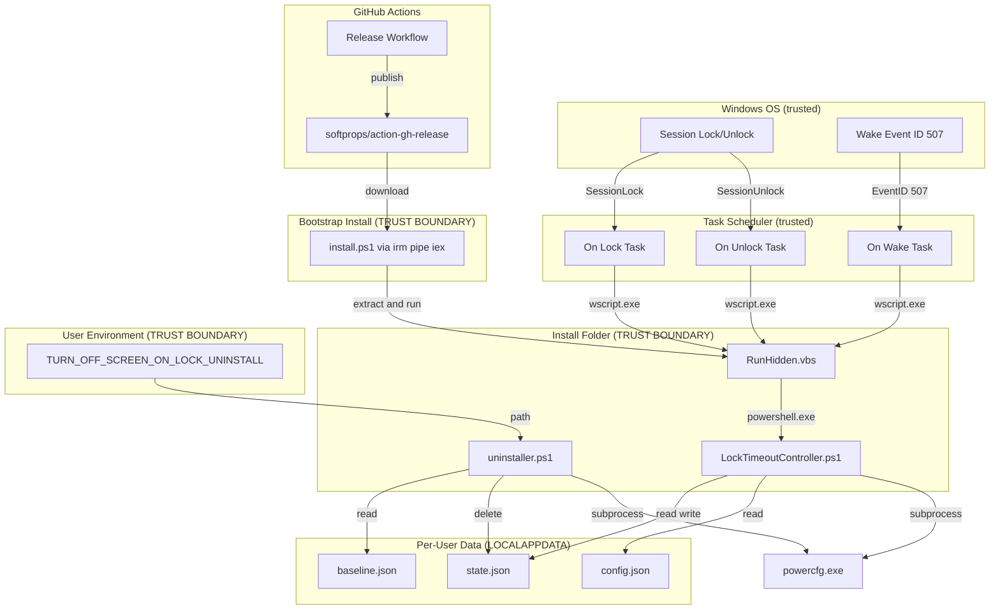

# Threat Model: Turn Off Screen on Lock

**Date:** 05-Apr-2026  
**Branch:** main  
**Release:** v1.0.1

---

## Executive summary

This project runs locally with no network exposure and stores no sensitive data. The main area of attention is **install-folder permissions**: scheduled tasks run with `HighestAvailable` privileges, so installing to a folder with appropriate NTFS ACLs (e.g. `Program Files`) is recommended to prevent unauthorized script modification. Additional considerations include the uninstaller environment variable and the bootstrap installer's `irm | iex` pattern, both documented in detail below.  
All-in-all, the project at its current state is **safe** for *home/personal usage*, but requires **further hardening** for *enterprise usage*.

---

## Scope and assumptions

### In-scope
- All runtime files: `installer.ps1`, `uninstaller.ps1`, `LockTimeoutController.ps1`, `RunHidden.vbs`, `%LOCALAPPDATA%\Turn-off-screen-on-lock\state.json`, `%LOCALAPPDATA%\Turn-off-screen-on-lock\config.json`, `%LOCALAPPDATA%\Turn-off-screen-on-lock\baseline.json`
- Bootstrap installer: `install.ps1` (downloaded and executed via `irm | iex`)
- Three Windows Scheduled Tasks created by the installer
- The install folder's permission model
- The `TURN_OFF_SCREEN_ON_LOCK_UNINSTALL` user-level environment variable
- CI/CD release workflow (`.github/workflows/release.yml`)

### Out-of-scope
- The Windows Task Scheduler service itself (trusted OS component)
- `powercfg.exe` internals (trusted OS binary)
- Attacks requiring kernel-level access or boot-time tampering

### Confirmed context
- **Primary deployment target**: home/single-user installs, but enterprise deployment scenarios must also be included in the risk assessment
- **Installing user privileges**: the installing user is a permanent local administrator
- **Enterprise execution context**: enterprise tooling (e.g., Intune) may execute the installer/uninstaller in `SYSTEM` context rather than user context
- **Shared machine**: other user accounts exist on the PC
- **Install folder assumption**: writable install locations remain in scope (not assumed ACL-hardened)
- **Public distribution**: intended for others to install on their own machines; published on GitHub
- **Assessment breadth**: includes local runtime/install/uninstall behavior and CI/CD release workflow
- **Uninstaller**: `uninstaller.ps1` unregisters all three scheduled tasks, restores VIDEOCONLOCK from `baseline.json`, removes the state directory, and clears the environment variable. Invoked via `& "$env:TURN_OFF_SCREEN_ON_LOCK_UNINSTALL"`
- **No network exposure**: purely local, no listeners or remote APIs
- **No secrets stored**: state.json contains GUIDs and timestamps only

---

## Attacker model

This section defines the realistic attacker profiles for this tool based on its exposure, deployment model, and trust boundaries. It separates what attackers can plausibly do from what they cannot, so that risk rankings in the summary table are grounded in concrete capabilities rather than theoretical worst cases. Threats that were investigated but found to be non-exploitable or out of scope are recorded under Non-capabilities.

### Capabilities
- **Local user on a shared machine**: can log in with their own account, read/write files in unprotected folders, run standard user-level tools
- **Low-privilege process**: malware or a compromised application running under any local account that has write access to the install folder
- **Social engineering**: for the public-distribution scenario, an attacker could distribute a modified copy of the scripts or trick a user into installing to an insecure location

### Non-capabilities
- **Remote network attacker**: there is no network surface — no listeners, no APIs, no remote management. Remote-only attackers cannot reach this tool.
- **Kernel-level attacker**: if an attacker already has kernel access, this tool does not meaningfully change the threat landscape.
- **Task Scheduler manipulation without admin**: non-admin users cannot modify or replace tasks registered by another user with `HighestAvailable` — the tasks themselves are protected by Windows.
- **TOCTOU race on state.json**: `PromoteOnWake` reads state and then calls `powercfg` without a file lock. A concurrent `OnUnlock` could interleave between the read and the write. However, the worst-case outcome is VIDEOCONLOCK staying at 300 seconds until the next lock/unlock cycle — a transient usability issue, not a privilege escalation or security boundary violation. Likelihood is low (sub-second timing overlap between distinct tasks). Not a security threat.
- **Runtime script integrity verification**: the scheduled tasks do not verify script hashes or signatures before execution. This is architecturally subsumed by RISK-002 — the trust boundary is the install folder's filesystem ACLs. An attacker who can replace the script can equally replace or remove any integrity check embedded in it, so in-script verification would not provide meaningful additional protection.
- **Binary planting via `powercfg` without full path**: both scripts invoke `powercfg` by name rather than full path. PowerShell's `&` operator resolves external commands via `$env:PATH`, not the current working directory (unlike `cmd.exe`). Placing a malicious `powercfg.exe` in the install folder has no effect. Manipulating the system `PATH` requires admin privileges, at which point the attacker already has the access this tool could grant. Not exploitable.
- **Baseline.json tampering as a distinct risk**: `baseline.json` stores the original VIDEOCONLOCK AC/DC values captured at install time and is read only during uninstallation. An attacker with write access could set incorrect values, causing the uninstaller to restore wrong display timeout settings. However, this is the same nuisance-level, same-trust-boundary class as state.json/config.json tampering (RISK-003) and does not escalate privileges. Folded into RISK-003 rather than tracked separately.
- **Bootstrap installer tag injection via GitHub API response**: the bootstrap script constructs download URLs using the `tag_name` from the GitHub API. A compromised API response could inject path-traversal characters into the tag. However, `Invoke-WebRequest -OutFile` writes to a literal filename (Windows does not resolve `..` in filenames), and `Expand-Archive -DestinationPath` is hardcoded to a fixed subdirectory. The resulting filenames would be malformed but not exploitable for path traversal. Not a distinct risk beyond the broader supply-chain vector (RISK-012).
- **DLL sideloading via `wscript.exe` working directory**: the scheduled task XML omits `<WorkingDirectory>`, so Task Scheduler defaults the working directory to `%SystemRoot%\System32`, which is admin-protected. An attacker cannot plant DLLs in the CWD-based search path via this route. If the attacker has write access to the install folder itself, DLL planting is subsumed by RISK-002 (script replacement via install folder ACLs).
- **Bootstrap CWD file race**: `install.ps1` downloads the release zip and checksum file to the current working directory. A pre-placed file at the same name would be overwritten by the download (`-OutFile`), and the window between download completion and checksum verification is sub-second. An attacker with write access to the CWD could equally tamper with the extracted files post-extraction, which is the same trust boundary as RISK-002 and RISK-012. Not a distinct exploitable vector.
- **TOCTOU in RunHidden.vbs file existence check**: `RunHidden.vbs` checks that `LockTimeoutController.ps1` exists (line 16) before building and executing the PowerShell command (line 29–31). The window between the existence check and execution is sub-millisecond (3 VBScript statements). An attacker would need write access to the install folder to swap the file in that window, but such access already enables direct script replacement (RISK-002). The race provides no additional attack capability. Subsumed by RISK-002.
- **XML injection in task registration via paths or usernames**: The installer constructs task XML using here-strings with interpolated values for paths and the current username. All interpolated values are escaped via `[System.Security.SecurityElement]::Escape()` before insertion, which handles all five XML predefined entities (`<`, `>`, `&`, `"`, `'`). No un-escaped values are interpolated into the XML. Not exploitable — [installer.ps1:330-334](src/installer.ps1#L330-L334).
- **Zip slip via `Expand-Archive` in bootstrap installer**: On PowerShell 5.1 (.NET Framework 4.x), `Expand-Archive` delegates to `ZipFile.ExtractToDirectory`, which does not validate path-traversal entries (e.g., `../../malicious.ps1`). However, the zip is downloaded from the same origin as the SHA-256 checksums — a crafted zip requires supply-chain compromise, at which point the attacker can already include arbitrary code without needing path traversal. Subsumed by RISK-012.
- **PowerShell profile loading in installer/uninstaller**: `RunHidden.vbs` invokes PowerShell with `-NoProfile`, protecting the automated runtime path. The installer and uninstaller are user-initiated one-time operations run from a normal PowerShell prompt where profile loading is standard behavior. A malicious profile would execute in any PowerShell session, not just this tool's. Not a vector specific to this tool.
- **Uninstaller `$sourceDir` derivation from environment variable**: The uninstaller reads `TURN_OFF_SCREEN_ON_LOCK_UNINSTALL` and derives `$sourceDir` via `Split-Path`. This value is used exclusively for a user-facing informational message ([uninstaller.ps1:222-227](src/uninstaller.ps1#L222-L227)) and is not used in any file operations, deletions, or path resolutions. Subsumed by RISK-010.
- **`HighestAvailable` RunLevel for standard (non-admin) users**: The tasks use `HighestAvailable` rather than `RequireAdministrator`. For a standard user, `powercfg` modifications to `SCHEME_CURRENT` generally succeed without elevation. The controller, installer, and uninstaller check `$LASTEXITCODE` after every `powercfg` write call and throw on failure, so `powercfg` errors are not silent. This is not a security boundary violation.
- **Junction/symlink on the data directory (write path)**: If an attacker pre-creates a junction at `%LOCALAPPDATA%\Turn-off-screen-on-lock` before installation, the installer and controller would write JSON files (state.json, config.json, baseline.json) through the junction into the target directory. The installer runs elevated, so it could write to protected locations — but the content is fixed non-executable JSON, limiting impact. The precondition requires write access to `%LOCALAPPDATA%`, which under default NTFS ACLs is restricted to the owning user and SYSTEM. This is the same trust boundary as RISK-003 (same-user access to data files). The uninstaller's `[System.IO.Directory]::Delete` safely removes junctions without traversing (RISK-013 mitigation). Not a distinct exploitable vector beyond the existing trust boundary.

---

## Risk Summary Table

This table is the primary deliverable for decision-making. Each row captures a specific threat, its classification derived from likelihood and impact, concrete remediations tied to repo locations, and the expected residual risk if remediations are applied. The Status column is owned by the project maintainer. 

This table documents only the remaining risks. Mitigated risks are removed from this table.

| Risk ID | Date Identified | Risk Name | Risk Description | Risk Classification | Suggested Remediations | Risk After Remediations | Status | Status Rationale |
|---------|-----------------|-----------|------------------|---------------------|------------------------|------------------------|---------|------------------|
| RISK-002 | 02-Apr-2026 | Script replacement privilege escalation | If the install folder is writable by other local users, an attacker can replace `LockTimeoutController.ps1` or `RunHidden.vbs` with malicious code that executes with the victim's elevated privileges on every lock/unlock/wake event. | High | • Document that users MUST install to an ACL-protected folder (e.g., `Program Files`) or manually restrict folder ACLs. • Add an installer check that warns if the folder is writable by non-admin accounts. | Medium | Accepted | Fine for home usage. |
| RISK-003 | 02-Apr-2026 | State and baseline file manipulation | An attacker with write access to `state.json` can force incorrect VIDEOCONLOCK promotion or suppression, causing usability issues (screen stays on too long or turns off during unlock). Tampering with `baseline.json` could cause the uninstaller to restore incorrect display timeout values. Both are nuisance-level impacts. | Low | • Per-user LOCALAPPDATA ACLs already isolate these files. No additional remediation needed beyond existing per-user isolation (RISK-007). | Low | Accepted | Fine for home usage. |
| RISK-004 | 03-Apr-2026 | Third-party redistribution of trojanized copies | A third party could host a modified copy of the tool (e.g., on a fake repository, blog, or file-sharing site). Because the tool requires admin privileges and registers persistent elevated tasks, a trojanized copy is a high-value social-engineering vector. | Low | • No additional technical remediation beyond what RISK-011 and RISK-012 already provide. Users who install from unofficial sources bypass all official integrity checks by definition. | Low | Accepted | Inherent to any open-source project; cannot be mitigated technically. |
| RISK-005 | 03-Apr-2026 | ExecutionPolicy Bypass in launcher | `RunHidden.vbs` launches PowerShell with `-ExecutionPolicy Bypass`, which circumvents script signing policies. On systems where execution policy is used as a defense-in-depth measure, this weakens that layer. | Low | • Document this in security notes. • Consider using `-ExecutionPolicy RemoteSigned` if scripts are unblocked locally. | Low | Accepted | Fine for home usage. |
| RISK-006 | 03-Apr-2026 | Enterprise context misalignment | When managed via Intune, the installer may run as `SYSTEM`, registering the current user as `SYSTEM`. This fails to trigger for the actual user and over-provisions permissions to the `SYSTEM` account. | High | • Check for `NT AUTHORITY\SYSTEM` in `installer.ps1` and fail early if user impersonation is not configured. • Guide administrators to deploy in the user context via Intune. | Low | Accepted | Fine for home usage. |
| RISK-010 | 03-Apr-2026 | Uninstaller path redirection via environment variable | The installer stores the uninstaller path in a user-level environment variable (`TURN_OFF_SCREEN_ON_LOCK_UNINSTALL`). Any process running as the user can overwrite this variable to point to a malicious script. When the user follows the documented uninstall procedure (`& "$env:TURN_OFF_SCREEN_ON_LOCK_UNINSTALL"`) in an elevated PowerShell session, the malicious script executes with administrator privileges. | Medium | • Document that users should verify the env var value before running it elevated (`echo $env:TURN_OFF_SCREEN_ON_LOCK_UNINSTALL`). • Add a guard in the uninstaller that verifies its own location is inside the expected install directory. • Consider replacing the env var approach with an Add/Remove Programs entry or a well-known path. | Low | Accepted | Fine for home usage. |
| RISK-012 | 04-Apr-2026 | Bootstrap installer executes without integrity verification | The default `irm \| iex` pattern executes `install.ps1` in an elevated shell without integrity verification. A compromised release or MITM could serve malicious code. A manual download-and-inspect method is documented in README, and `install.ps1` is included in the release checksums. | Medium | • Add Authenticode signing to `install.ps1` so PowerShell can verify publisher identity before execution. | Low | Accepted | Requires a paid code-signing certificate or GitHub artifact attestations (which requires users to manually run gh attestation verify before executing). |

### Remediated risks

Risks where remediations have been implemented in code or configuration.

| Risk ID | Date Identified | Risk Name | Risk Description | Risk Classification | Implemented Remediations | Risk After Remediations | Status  |
|---------|-----------------|-----------|------------------|---------------------|------------------------|------------------------|-------------|
| RISK-001 | 02-Apr-2026 | Command injection via unvalidated VBScript action argument | `RunHidden.vbs` concatenates the Task Scheduler–supplied action argument directly into a `powershell.exe` command string without validation or quoting. A crafted or manipulated action value (e.g., via a tampered task definition or a future code path that passes unsanitised input) could inject arbitrary PowerShell commands that execute with `HighestAvailable` privileges. | High | • Added a strict allowlist (`Select Case`) in `RunHidden.vbs` that rejects any action not in `onlock\|onunlock\|promoteonwake`, exiting with code 1 for unknown values. • Quoted the `-Action` value with double-quotes when building the command string to preserve argument boundaries. | Low | Remediated |
| RISK-007 | 03-Apr-2026 | Cross-session state conflict in shared environments | On multi-user enterprise PCs, `state.json` is a shared file. Concurrent locks/unlocks by distinct users will overwrite state unexpectedly, leading to failed state validation or undesired timeout overrides. | Medium | • State files are stored in user-specific isolated paths (`$env:LOCALAPPDATA`) instead of the root install folder. | Low | Remediated |
| RISK-008 | 03-Apr-2026 | Orphaned task binary planting after incomplete removal | There is no uninstaller. If a user deletes the install folder without unregistering the three scheduled tasks, the tasks remain active and point to the original script paths. An attacker who can create files at the deleted path (e.g., another user on a shared machine, or malware) can plant a malicious `RunHidden.vbs` that will execute with the original user's `HighestAvailable` privileges on the next lock, unlock, or wake event. | Medium | • Added an uninstaller script (`uninstaller.ps1`) that unregisters all three scheduled tasks before file removal and verifies each task is removed. • Added a pre-flight check in `RunHidden.vbs` that verifies `LockTimeoutController.ps1` exists alongside it and exits with code 2 if missing, reducing the window for planting. | Low | Remediated |
| RISK-009 | 03-Apr-2026 | Config file tampering | An attacker with write access to `config.json` can set extreme timeout values (e.g., `baselineTimeoutSeconds = 86400`) causing the screen to never turn off after locking, or set very low `wakeTimeoutSeconds` causing the screen to turn off before the user can unlock. | Low | • Config stored in per-user `LOCALAPPDATA` path, protected by NTFS ACLs. • Values clamped to 1–86400 range. • `wakeTimeoutSeconds >= baselineTimeoutSeconds` cross-field constraint enforced. • Invalid or missing config falls back to safe defaults. | Low | Remediated |
| RISK-011 | 03-Apr-2026 | CI/CD release workflow compromise | If repository write access or workflow execution context is compromised, an attacker could push a malicious tag or modify the release workflow to publish trojanized artifacts through the official pipeline. This risk covers pipeline-level controls only; automatic integrity verification by consumers during `irm \| iex` is covered by RISK-012. | Low | • Third-party actions pinned to immutable commit SHAs (`softprops/action-gh-release@153bb8e...`). • Branch protection enabled on `main` (requires PR review, dismisses stale reviews, blocks force pushes). • Tag ruleset active on `refs/tags/v*` restricting creation, deletion, and non-fast-forward to admin/maintain roles. | Low | Remediated |
| RISK-013 | 04-Apr-2026 | Arbitrary File Deletion via uninstaller Junction traverse | `uninstaller.ps1` executed `Remove-Item -LiteralPath $DataDir -Recurse -Force` with Administrator privileges. Since `$DataDir` (`%LOCALAPPDATA%\Turn-off-screen-on-lock`) is in the user's Medium-Integrity profile, malware could replace this directory with an NTFS junction pointing to OS locations. In PowerShell 5.1, `Remove-Item -Recurse` traverses junctions and blindly deletes the target's contents. | High | • Replaced `Remove-Item -Recurse` with `[System.IO.Directory]::Delete($DataDir, $true)`, which removes junction entries without traversing into the target. | Low | Remediated |

### Status definitions
| Term | Meaning |
|--------|---------|
| **Rejected** | The identified risk is disputed or deemed not applicable; no action will be taken. |
| **Accepted** | The risk is acknowledged and intentionally accepted without remediation (e.g., low impact, not applicable to the deployment context, or cost exceeds benefit). |
| **Planned** | The remediation is accepted and scheduled for a future change. |
| **Ongoing** | The suggested remediation is being applied. |
| **Remediated** | The suggested remediation has been applied in code or configuration. |

---

## System model

### Primary components

| Component | Type | Role | Evidence |
|---|---|---|---|
| `install.ps1` | PowerShell bootstrap script | Downloaded and executed via `irm \| iex`; fetches the latest release zip, verifies its checksum, extracts, and runs `installer.ps1` | [install.ps1](src/install.ps1) |
| `installer.ps1` | PowerShell script | One-time setup: creates tasks, initializes state, sets VIDEOCONLOCK baseline | [installer.ps1](src/installer.ps1) |
| `LockTimeoutController.ps1` | PowerShell script | Runtime controller: state transitions, VIDEOCONLOCK writes | [LockTimeoutController.ps1](src/LockTimeoutController.ps1) |
| `RunHidden.vbs` | VBScript launcher | Hides PowerShell console window; action whitelist gate | [RunHidden.vbs](src/RunHidden.vbs) |
| `%LOCALAPPDATA%\Turn-off-screen-on-lock\state.json` | JSON file | Per-user runtime state: lock status, generation GUID, timestamp | Stored in user's local app data |
| `%LOCALAPPDATA%\Turn-off-screen-on-lock\config.json` | JSON file | Per-user configuration: baseline and wake timeout values | Stored in user's local app data |
| `%LOCALAPPDATA%\Turn-off-screen-on-lock\baseline.json` | JSON file | Original VIDEOCONLOCK AC/DC values captured at install time; read by uninstaller to restore settings | Stored in user's local app data |
| `uninstaller.ps1` | PowerShell script | Removes scheduled tasks, restores VIDEOCONLOCK, cleans up state directory and env var | [uninstaller.ps1](src/uninstaller.ps1) |
| `TURN_OFF_SCREEN_ON_LOCK_UNINSTALL` | User-level env var | Points to the uninstaller script path; set by installer, cleared by uninstaller | Set via `[Environment]::SetEnvironmentVariable` in [installer.ps1:488-490](src/installer.ps1#L488-L490) |
| Scheduled Tasks (x3) | Windows Task Scheduler | Event-driven triggers for lock/unlock/wake | Created by installer, XML in [installer.ps1:336-480](src/installer.ps1#L336-L480) |
| `.github/workflows/release.yml` | GitHub Actions workflow | Creates release zip and publishes to GitHub Releases on tag push | [release.yml](.github/workflows/release.yml) |
| `powercfg.exe` | OS binary (out of scope) | Writes VIDEOCONLOCK power setting | Called from controller, installer, and uninstaller |

### Data flows and trust boundaries

This subsection traces how data moves between components and identifies the trust boundaries each flow crosses. Each boundary notes the protocol, authentication, and validation in place, so that gaps are visible and traceable to risks in the summary table.

- **Windows Session Events → Task Scheduler → RunHidden.vbs**
  - Data: event type (SessionLock, SessionUnlock, EventID 507)
  - Channel: Windows Task Scheduler invocation
  - Security: OS-controlled trigger; task runs under the registered user's interactive token at `HighestAvailable` privilege
  - Validation: none needed — OS guarantees event authenticity

- **RunHidden.vbs → LockTimeoutController.ps1**
  - Data: action string (one of three whitelisted values)
  - Channel: process invocation via `WScript.Shell.Run`
  - Security: VBScript whitelist (`Select Case`) restricts action to `onlock|onunlock|promoteonwake` — [RunHidden.vbs:22-27](src/RunHidden.vbs#L22-L27)
  - Validation: invalid actions cause `WScript.Quit 1`; PowerShell `ValidateSet` provides a second check — [LockTimeoutController.ps1:4](src/LockTimeoutController.ps1#L4)

- **LockTimeoutController.ps1 → state.json**
  - Data: JSON with status, generation GUID, timestamp
  - Channel: file I/O (`Set-Content` / `Get-Content`) to `%LOCALAPPDATA%\Turn-off-screen-on-lock\state.json`
  - Security: per-user isolation via `%LOCALAPPDATA%` — each user's state is separate; other users cannot write to it under default NTFS ACLs
  - Validation: controller checks for required fields before acting on state

- **LockTimeoutController.ps1 → config.json**
  - Data: JSON with baselineTimeoutSeconds and wakeTimeoutSeconds
  - Channel: file I/O (`Get-Content`) from `%LOCALAPPDATA%\Turn-off-screen-on-lock\config.json`
  - Security: per-user isolation via `%LOCALAPPDATA%`; values validated and clamped to 1–86400 range
  - Validation: controller validates type, range, and cross-field constraints; falls back to defaults on any error

- **LockTimeoutController.ps1 → powercfg.exe**
  - Data: integer seconds value (from config.json, defaults 5 and 300)
  - Channel: subprocess execution
  - Security: values sourced from per-user config file with validation and clamping
  - Validation: `ValidateRange(0, 86400)` on the parameter

- **User-level environment variable → uninstaller.ps1**
  - Data: file path string pointing to `uninstaller.ps1`
  - Channel: `[Environment]::GetEnvironmentVariable('TURN_OFF_SCREEN_ON_LOCK_UNINSTALL', 'User')`
  - Security: user-level env vars are writable by any process running as that user — no integrity protection beyond user session isolation
  - Validation: none — the user executes whatever path the variable contains

- **uninstaller.ps1 → baseline.json**
  - Data: JSON with originalAC and originalDC integer values
  - Channel: file I/O (`Get-Content`) from `%LOCALAPPDATA%\Turn-off-screen-on-lock\baseline.json`
  - Security: per-user isolation via `%LOCALAPPDATA%`; values validated as integers
  - Validation: falls back to 60-second defaults if file is missing or malformed — [uninstaller.ps1:138-159](src/uninstaller.ps1#L138-L159)

- **GitHub Releases → install.ps1 (bootstrap) → installer.ps1**
  - Data: bootstrap script (`install.ps1`), release zip, checksums file
  - Channel: HTTPS via `Invoke-RestMethod` (GitHub API) and `Invoke-WebRequest` (GitHub Releases CDN)
  - Security: TLS protects transport; bootstrap script itself has no integrity verification; zip is verified against a same-origin SHA-256 checksum file — [install.ps1:17-26](src/install.ps1#L17-L26)
  - Validation: checksum mismatch aborts installation and deletes the zip — [install.ps1:23-26](src/install.ps1#L23-L26)

- **GitHub Actions → GitHub Releases**
  - Data: release zip containing runtime scripts
  - Channel: GitHub Actions workflow triggered by tag push
  - Security: `contents: write` permission via `GITHUB_TOKEN`; third-party action pinned to immutable commit SHA (`softprops/action-gh-release@153bb8e...`)
  - Validation: workflow generates and publishes SHA-256 checksums for release zip artifacts

- **TRUST BOUNDARY: Install folder filesystem permissions**
  - This is the critical boundary for scripts. The scheduled tasks execute scripts from the install folder with elevated privileges. If the folder is writable by untrusted users, the trust boundary is broken.

- **TRUST BOUNDARY: Per-user data directory**
  - `state.json`, `config.json`, and `baseline.json` live under `%LOCALAPPDATA%\Turn-off-screen-on-lock\`, which is per-user and protected by default NTFS ACLs. This isolates state across users on shared machines.

- **TRUST BOUNDARY: User-level environment variables**
  - `TURN_OFF_SCREEN_ON_LOCK_UNINSTALL` is a user-level env var writable by any process running as that user. The documented uninstall procedure executes its value in an elevated shell, creating a privilege escalation vector if the variable is tampered with.

#### Diagram

---

## Assets and security objectives

This section identifies the data, components, and configuration that an attacker would target and states the security property (integrity, availability, confidentiality) that must be preserved for each. These objectives drive the risk classifications in the summary table.

| Asset | Why it matters | Security objective |
|---|---|---|
| Runtime scripts (`LockTimeoutController.ps1`, `RunHidden.vbs`) | Executed with elevated privileges on every lock/unlock/wake cycle | **Integrity** — unauthorized modification = arbitrary code execution |
| Installer script (`installer.ps1`) | Creates scheduled tasks with elevated privileges; re-running replaces tasks | **Integrity** — tampering could register malicious tasks |
| `state.json` | Controls whether VIDEOCONLOCK is promoted | **Integrity** — manipulation causes incorrect power behavior (nuisance, not privilege escalation) |
| `config.json` | Controls baseline and wake timeout values used by the controller | **Integrity** — manipulation causes incorrect timeout behavior (nuisance, not privilege escalation) |
| `baseline.json` | Stores original VIDEOCONLOCK values for restore on uninstall | **Integrity** — manipulation causes wrong values to be restored (nuisance, not privilege escalation) |
| VIDEOCONLOCK power setting | Controls lock-screen display timeout | **Availability** — incorrect values cause usability issues (screen stays on or turns off too fast) |
| `TURN_OFF_SCREEN_ON_LOCK_UNINSTALL` env var | Points to the uninstaller script path; user executes it with admin privileges | **Integrity** — redirection to a malicious script leads to arbitrary code execution with admin privileges |
| Scheduled task definitions | Determine what runs and when | **Integrity** — if an attacker can modify task XML or re-register tasks, they gain persistent code execution |
| Release artifacts (GitHub Releases zip) | Distributed to users for installation | **Integrity** — tampered artifacts lead to users installing malicious code |
| Bootstrap script (`install.ps1`) | First code executed during installation; downloaded and run via `irm \| iex` in an elevated shell | **Integrity** — no pre-execution integrity check; tampering leads to arbitrary admin-level code execution |

---

## Entry points and attack surfaces

This section enumerates the concrete points where external input or untrusted data enters the system. Each entry identifies the trust boundary it crosses and the controls (or lack thereof) that govern it, so that risk assessments in the summary table are traceable to specific surfaces.

| Surface | How reached | Trust boundary | Notes | Evidence |
|---|---|---|---|---|
| Install folder (scripts) | Local filesystem write | Folder ACLs | **Primary attack surface.** If writable by other users, scripts can be replaced. | [RunHidden.vbs](src/RunHidden.vbs), [LockTimeoutController.ps1](src/LockTimeoutController.ps1) |
| `state.json` | Local filesystem write | Per-user LOCALAPPDATA ACLs | Tampering changes power behavior but does not escalate privilege. Now isolated per user. | `%LOCALAPPDATA%\Turn-off-screen-on-lock\state.json` |
| `config.json` | Local filesystem write | Per-user LOCALAPPDATA ACLs | Tampering changes timeout values but does not escalate privilege. Values are validated and clamped. | `%LOCALAPPDATA%\Turn-off-screen-on-lock\config.json` |
| VBScript action argument | Task Scheduler → wscript.exe | OS process invocation | Whitelisted in VBS and validated in PS. Not attacker-controllable unless scripts are replaced. | [RunHidden.vbs:7-18](src/RunHidden.vbs#L7-L18) |
| Installer re-execution | Admin PowerShell session | Requires elevation | An attacker who tricks a user into re-running a tampered installer gets task re-registration. | [installer.ps1](src/installer.ps1) |
| Uninstaller env var | User-level environment variable | User session isolation | Any user-level process can overwrite `TURN_OFF_SCREEN_ON_LOCK_UNINSTALL` to point to a malicious script. User then executes it in an elevated shell. | [installer.ps1:488-490](src/installer.ps1#L488-L490), README uninstall instructions |
| Orphaned install path | Local filesystem write | Folder ACLs on deleted path | After incomplete removal (scripts deleted, tasks not unregistered), the original path becomes a planting target for malicious scripts. | Task XML embeds path to `RunHidden.vbs` — [installer.ps1:330-333](src/installer.ps1#L330-L333) |
| Bootstrap installer (`install.ps1`) | User runs `irm <url> \| iex` in elevated PowerShell | TLS transport to GitHub; no integrity check on the bootstrap script itself | The bootstrap script is the first code executed during installation. It has no signature or checksum verification. The zip it downloads is checksum-verified, but checksums are same-origin. | [install.ps1](src/install.ps1), [README.md](README.md) |
| Release workflow | GitHub Actions on tag push | GitHub repository access controls | Third-party action is SHA-pinned and checksums are generated; residual risk is repository/workflow compromise or users skipping checksum verification. | [release.yml](.github/workflows/release.yml) |

---

## Top abuse paths

This section describes the most realistic end-to-end attack scenarios, ordered by severity. Each path walks through the attacker's goal, the steps required, and the resulting impact, connecting entry points and trust boundaries from the sections above to the risks in the summary table.

### 1. Script replacement → elevated code execution
**Attacker goal:** Execute arbitrary code with the installing user's elevated privileges.
1. Attacker (local user or malware) writes to the unprotected install folder.
2. Replaces `LockTimeoutController.ps1` or `RunHidden.vbs` with a malicious payload.
3. Victim locks or unlocks their workstation (normal daily activity).
4. Scheduled task fires and executes the replaced script with `HighestAvailable` privilege.
5. **Impact:** Arbitrary code execution as the victim, potentially with admin rights.

### 2. Installer tampering → persistent backdoor via task registration
**Attacker goal:** Establish persistent elevated execution by modifying the installer.
1. Attacker replaces `installer.ps1` with a modified version containing malicious task XML.
2. Victim re-runs the installer (e.g., after an update or troubleshooting).
3. Malicious tasks are registered under the victim's credentials with `HighestAvailable`.
4. **Impact:** Persistent arbitrary code execution triggered by OS events.

### 3. State file tampering → denial of usability
**Attacker goal:** Cause annoyance by manipulating lock-screen display behavior.
1. Attacker writes `{"status":"locked","generation":"<guid>","lastActionUtc":"..."}` to state.json while the system is unlocked.
2. On next wake event, controller sees status=locked and promotes VIDEOCONLOCK to 300s.
3. User locks the PC; screen stays on for 5 minutes instead of 5 seconds.
4. **Impact:** Usability degradation (nuisance-level).

### 4. State file tampering → prevent promotion
**Attacker goal:** Prevent the screen-stay-on behavior when waking from standby.
1. Attacker continuously overwrites state.json with `status=unlocked`.
2. PromoteOnWake checks find status != locked, skip promotion.
3. User wakes system from standby; screen turns off again in 5 seconds before they can unlock.
4. **Impact:** Usability degradation (nuisance-level).

### 5. Orphaned task binary planting
**Attacker goal:** Execute arbitrary code via tasks left behind after incomplete removal.
1. User deletes the install folder contents without unregistering the three scheduled tasks.
2. Tasks remain registered, pointing to the original `RunHidden.vbs` path.
3. Attacker (local user or malware) creates a malicious `RunHidden.vbs` at the original install path.
4. Victim locks, unlocks, or wakes their workstation.
5. Scheduled task fires and executes the planted script with `HighestAvailable` privilege.
6. **Impact:** Arbitrary code execution as the victim, potentially with admin rights.

### 6. Uninstaller environment variable redirection
**Attacker goal:** Execute arbitrary code with administrator privileges during uninstallation.
1. Malware or a local attacker process running as the user overwrites `TURN_OFF_SCREEN_ON_LOCK_UNINSTALL` to point to a malicious script (e.g., `C:\Temp\payload.ps1`).
2. User decides to uninstall and follows the documented procedure: opens PowerShell as Administrator and runs `& "$env:TURN_OFF_SCREEN_ON_LOCK_UNINSTALL"`.
3. The malicious script executes with full administrator privileges.
4. **Impact:** Arbitrary code execution with admin rights. The user has no indication that the env var was tampered with.

### 7. Supply-chain risk — malicious fork or download
**Attacker goal:** Distribute a trojanized version of the tool.
1. Attacker forks the public repo and adds malicious code to the controller script.
2. Victim downloads and installs from the malicious source.
3. Installer registers tasks that execute the malicious controller with admin privileges.
4. **Impact:** Persistent elevated code execution on victim's machine.

### 8. Bootstrap installer compromise via release tampering
**Attacker goal:** Execute arbitrary code with admin privileges during initial installation.
1. Attacker compromises the GitHub repository or release pipeline (e.g., via stolen maintainer credentials or a compromised CI token).
2. Attacker publishes a malicious `install.ps1` alongside a tampered release zip with matching checksums.
3. Victim follows the README instructions: opens PowerShell as Administrator and runs `irm <url> | iex`.
4. The malicious bootstrap script executes immediately with admin privileges — there is no pre-execution inspection step.
5. Even if the bootstrap script were legitimate, the tampered zip passes checksum verification because the checksums are same-origin.
6. **Impact:** Arbitrary code execution with admin privileges. The entire installation chain is compromised from the first instruction.

---

## Focus paths for security review

This section lists the specific files and locations that a security reviewer should prioritize when auditing this codebase. Each path is linked to the risks it is most relevant to, providing a starting point for targeted code review.

| Path | Why it matters | Related Threat IDs |
|---|---|---|
| [RunHidden.vbs](src/RunHidden.vbs) | Launches PowerShell with `-ExecutionPolicy Bypass`; action whitelist is the only input validation gate before elevated execution | RISK-001, RISK-005 |
| [LockTimeoutController.ps1](src/LockTimeoutController.ps1) | Core runtime script executed with elevated privileges on every cycle; primary target for replacement | RISK-001, RISK-002 |
| [installer.ps1](src/installer.ps1) | Registers tasks with `HighestAvailable` and `RunLevel`; sets uninstaller env var | RISK-006, RISK-010 |
| [uninstaller.ps1](src/uninstaller.ps1) | Runs with admin privileges; reads baseline.json to restore VIDEOCONLOCK; target of env var redirection attack; uses .NET `Directory.Delete` for safe DataDir removal | RISK-008, RISK-010, RISK-013 |
| `%LOCALAPPDATA%\Turn-off-screen-on-lock\state.json` | Per-user isolated; no integrity protection beyond NTFS ACLs | RISK-003, RISK-007 |
| `%LOCALAPPDATA%\Turn-off-screen-on-lock\config.json` | Per-user isolated; validated on read; no integrity protection beyond NTFS ACLs | RISK-009 |
| `%LOCALAPPDATA%\Turn-off-screen-on-lock\baseline.json` | Per-user isolated; read by uninstaller to restore original values; tampering causes wrong restore | RISK-003 |
| [installer.ps1:330-333](src/installer.ps1#L330-L333) | Task XML embeds absolute paths to `RunHidden.vbs`; these paths become planting targets after incomplete removal | RISK-008 |
| [install.ps1](src/install.ps1) | Bootstrap installer downloaded and executed via `irm \| iex` with no integrity check on the script itself; same-origin checksum verification on the zip | RISK-012 |
| [.github/workflows/release.yml](.github/workflows/release.yml) | Release workflow is part of the official distribution trust chain; action pinning/checksums exist but pipeline integrity still matters | RISK-011, RISK-012 |

---

## Conclusion

**The overall security posture of this tool is reasonable for its scope.**

All identified High-severity vulnerabilities have been remediated: RISK-001 (command injection via VBScript) was addressed with an action allowlist, and RISK-013 (arbitrary file deletion via junction traversal) was resolved by replacing `Remove-Item -Recurse` with `[System.IO.Directory]::Delete($DataDir, $true)`, which does not traverse NTFS junctions. Other implemented mitigations cover per-user state isolation (RISK-007), uninstaller cleanup (RISK-008), config validation (RISK-009), and CI/CD pipeline hardening (RISK-011). The remaining accepted risks (RISK-002 through RISK-012, excluding remediated entries) are Low to Medium severity with mitigations either in place or accepted given the tool's single-user local deployment context.
